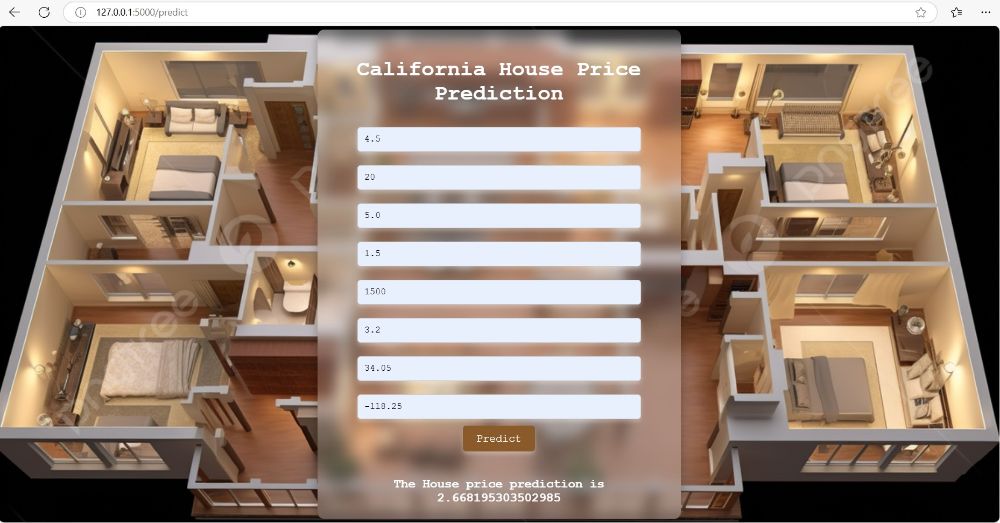

### California House Pricing Prediction

### Software And Tools Requirements

1. [Github Account](https://github.com)
2. [VSCodeIDE](https://code.visualstudio.com/)
3. [GitCLI](https://git-scm.com/book/en/v2/Getting-Started-The-Command-Line)
4. FLASK

create a new environment

'''
conda create -p venv python==3.7 -y
'''

### Output Screenshot
